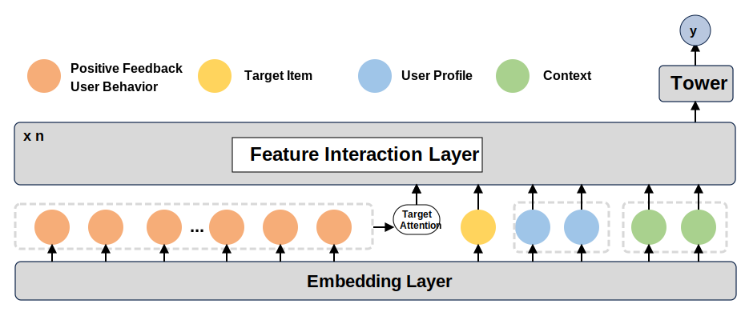
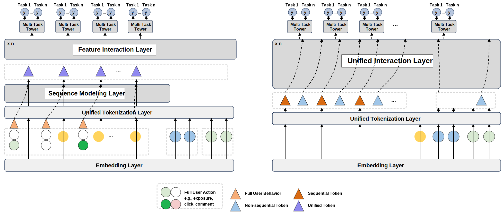
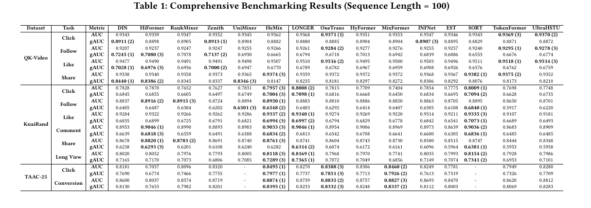

# UniRank <sub>v0.1.0, work in progress</sub>

**A Ranking Model Benchmark for Unified Sequential Modeling and Feature Interaction**

UniRank is an open PyTorch benchmark for large-scale recommendation ranking models. It focuses on a practical setting that is increasingly common in industrial recommender systems: ranking models must jointly learn from heterogeneous non-sequential features, target item features, and long user behavior sequences under multi-feedback objectives such as click, follow, like, share, comment, long-view, and conversion.

The project is built to make modern unified ranking architectures easier to compare, reproduce, and extend. It provides standardized dataset configurations, model implementations, distributed training utilities, mixed precision support, blocked data loading for large datasets, and sparse attention acceleration for long-sequence models.

## Why UniRank?

Modern ranking research is moving from isolated feature interaction or sequence pooling modules toward unified architectures that model feature fields and user behavior tokens together. However, many strong ranking models are released from industrial systems where data, implementations, and infrastructure are not fully available. This makes it difficult to answer basic research questions:

- Which architecture works best under the same data split, sequence length, and metric protocol?
- How should feature interaction and sequential modeling be combined?
- How do models behave across different feedback tasks rather than only CTR?
- What engineering support is needed to train ranking models on industrial-scale data?

UniRank addresses these gaps by collecting representative ranking models, unified data processing logic, and reproducible experiment settings in one benchmark.

## Architecture Design

UniRank follows a unified ranking pipeline. Raw user, item, context, and action features are embedded, converted into model-specific tokens, passed through feature interaction or sequence interaction layers, and finally predicted by task-specific towers.

<p align="center">
  
</p>

**Figure 1. Traditional New Impression Only Paradigm.** Most conventional ranking systems train on the latest impressed target item only. Historical positive feedback is used as auxiliary behavior context, usually through target attention, pooling, or aggregation, before being combined with target item, user profile, and context features in a feature interaction layer. This paradigm is efficient, but it treats each target impression as an independent sample and does not fully exploit the step-by-step evolution of user behavior.

<p align="center">
  
</p>

**Figure 2. UniRank Auto-Regressive Paradigm.** UniRank reorganizes user histories as sequential training samples. Each behavior step can be represented with action-aware tokens, target item tokens, and non-sequential feature tokens. Instead of only predicting the latest impression, the model learns from the chronological behavior sequence and supports multi-task prediction at different positions. This design better matches long user histories and enables unified sequence-feature interaction.

Following the paper, UniRank organizes representative unified ranking models into two architectural paradigms:

| Paradigm | Description | Representative Models |
|:--|:--|:--|
| Tokenization after Pooling or Aggregation | First pool or aggregate the behavior sequence into compact sequence representations, then tokenize these representations together with non-sequential features for interaction. | HiFormer, RankMixer, Zenith, UniMixer, HeMix |
| Layer-wise Unified Interaction | Keep sequence tokens and non-sequence tokens inside the interaction layers, allowing behavior tokens, field tokens, and target tokens to exchange information throughout the network. | OneTrans, HyFormer, MixFormer, INFNet, EST, SORT, TokenFormer, LONGER, UltraHSTU |

Design choices in this repository are intentionally practical:

- **Multi-feedback ranking**: each dataset can define multiple binary feedback tasks and evaluate AUC/gAUC per task.
- **Auto-regressive / user-centric training support**: long behavior histories can be represented as structured action sequences rather than only a latest-impression sample.
- **Distributed training**: `torchrun` + DDP are supported through `run_expid.py`.
- **Large data loading**: blocked parquet loading is supported for large datasets such as TencentGR-10M.
- **Mixed precision and operator acceleration**: bf16 training and sparse/flex attention paths are available for compatible models.

## Repository Structure

```text
UniRank/
+-- config/
|   +-- dataset_config.yaml      # Dataset paths, feature schemas, labels, and blocked-loading options
|   +-- model_config.yaml        # Experiment ids and hyperparameters
+-- data/
|   +-- QK_Video_Action/
|   +-- KuaiRand_Video_Action/
|   +-- TencentGR_10M_Action_Blocked/
+-- fuxictr/                     # Adapted FuxiCTR training, feature, metric, and layer utilities
+-- model_zoo/                   # Ranking model implementations
+-- checkpoints/                 # Saved models and experiment logs
+-- test/                        # Metric and utility tests
+-- UniRank_Dataloader.py        # UniRank-specific sequence/action dataloader
+-- run_expid.py                 # Run one experiment
+-- run_all.sh                   # Run a list of experiments
+-- run_param_tuner.py           # Hyperparameter tuning entry
+-- autotuner.py                 # Tuning utilities
+-- requirements.txt
+-- README.md
```

## Datasets

### Raw Datasets

- [QK-Video](https://static.qblv.qq.com/qblv/h5/algo-frontend/tenrec_dataset.html)
- [KuaiRand](https://kuairand.com/)
- [TAAC2025 / TencentGR-10M](https://huggingface.co/datasets/TAAC2025/TencentGR-10M)

### Preprocessed Datasets

- [QK_Video_Action](https://huggingface.co/datasets/salmon1802/QK_Video_Action)
- [KuaiRand_Video_Action](https://huggingface.co/datasets/salmon1802/KuaiRand_Video_Action)
- [TencentGR_10M_Action](https://huggingface.co/datasets/salmon1802/TencentGR_10M_Action_Blocked)

Place the downloaded preprocessed datasets under `./data/` using the same directory names as the dataset ids in `config/dataset_config.yaml`.

## Models

| No. | Model | Publication |
|:--:|:--|:--|
| 1 | [DIN](./model_zoo/DIN.py) | [Deep Interest Evolution Network for Click-Through Rate Prediction](https://arxiv.org/abs/1809.03672) |
| 2 | [HiFormer](./model_zoo/HiFormer.py) | [Hiformer: Heterogeneous Feature Interactions Learning with Transformers for Recommender Systems](https://arxiv.org/pdf/2311.05884) |
| 3 | [RankMixer](./model_zoo/RankMixer.py) | [RankMixer: Scaling Up Ranking Models in Industrial Recommenders](https://arxiv.org/abs/2507.15551) |
| 4 | [Zenith](./model_zoo/Zenith.py) | [Zenith: Scaling up Ranking Models for Billion-scale Livestreaming Recommendation](https://arxiv.org/pdf/2601.21285) |
| 5 | [UniMixer](./model_zoo/UniMixer.py) | [UniMixer: A Unified Architecture for Scaling Laws in Recommendation Systems](https://arxiv.org/pdf/2604.00590) |
| 6 | [HeMix](./model_zoo/HeMix.py) | [Query-Mixed Interest Extraction and Heterogeneous Interaction: A Scalable CTR Model for Industrial Recommender Systems](https://arxiv.org/pdf/2602.09387) |
| 7 | [LONGER](./model_zoo/LONGER.py) | [LONGER: Scaling Up Long Sequence Modeling in Industrial Recommenders](https://arxiv.org/abs/2505.04421) |
| 8 | [OneTrans](./model_zoo/OneTrans.py) | [OneTrans: Unified Feature Interaction and Sequence Modeling with One Transformer in Industrial Recommender](https://arxiv.org/abs/2510.26104) |
| 9 | [HyFormer](./model_zoo/HyFormer.py) | [HyFormer: Revisiting the Roles of Sequence Modeling and Feature Interaction in CTR Prediction](https://arxiv.org/abs/2601.12681) |
| 10 | [MixFormer](./model_zoo/MixFormer.py) | [MixFormer: Co-Scaling Up Dense and Sequence in Industrial Recommenders](https://arxiv.org/abs/2602.14110) |
| 11 | [INFNet](./model_zoo/INFNet.py) | [INFNet: A Task-aware Information Flow Network for Large-Scale Recommendation Systems](https://arxiv.org/pdf/2508.11565v1) |
| 12 | [EST](./model_zoo/EST.py) | [EST: Towards Efficient Scaling Laws in Click-Through Rate Prediction via Unified Modeling](https://arxiv.org/pdf/2602.10811) |
| 13 | [SORT](./model_zoo/SORT.py) | [SORT: A Systematically Optimized Ranking Transformer for Industrial-scale Recommenders](https://arxiv.org/abs/2603.03988) |
| 14 | [TokenFormer](./model_zoo/TokenFormer.py) | [TokenFormer: Unify the Multi-Field and Sequential Recommendation Worlds](https://arxiv.org/abs/2604.13737) |
| 15 | [UltraHSTU](./model_zoo/UltraHSTU.py) | [Bending the Scaling Law Curve in Large-Scale Recommendation Systems](https://arxiv.org/pdf/2602.16986) |

Additional experimental or auxiliary implementations may also appear in `model_zoo/`.

## Benchmark

The table below reports preliminary benchmarking results with sequence length 100.

<p align="center">
  
</p>

**Figure 3. Preliminary Benchmark Results.** The benchmark evaluates 15 ranking models on QK-Video, KuaiRand, and TAAC-25 under AUC and gAUC. Results are reported for multiple feedback tasks, including click, follow, like, share, comment, long view, and conversion. Bold values indicate top-performing results for each task-metric pair.

## Installation

```bash
conda create -n UniRank python=3.9
conda activate UniRank

pip install torch==2.7.0 torchvision==0.22.0 torchaudio==2.7.0 --index-url https://download.pytorch.org/whl/cu118
pip install -r requirements.txt
```

## How to Use

### 1. Download datasets

Download the preprocessed datasets from Hugging Face and place them under `./data/`:

```text
data/
+-- QK_Video_Action/
+-- KuaiRand_Video_Action/
+-- TencentGR_10M_Action_Blocked/
```

Check `config/dataset_config.yaml` if you want to change paths, feature schemas, labels, or blocked-loading settings.

### 2. Run one experiment

Single GPU:

```bash
python run_expid.py --config ./config --expid DIN_KuaiRand_Video_Action --gpu 0
```

Multi-GPU DDP:

```bash
torchrun --standalone --nproc_per_node=2 run_expid.py \
  --config ./config \
  --expid DIN_KuaiRand_Video_Action \
  --gpu 0,1
```

Experiment ids are defined in `config/model_config.yaml` and usually follow:

```text
<Model>_<Dataset>
```

Examples:

```text
UltraHSTU_QK_Video_Action
TokenFormer_KuaiRand_Video_Action
LONGER_TencentGR_10M_Action
```

### 3. Run a batch of experiments

Edit `run_all.sh` to uncomment the experiments you want, then run:

```bash
chmod +x run_all.sh
./run_all.sh
```

Logs and checkpoints are written to `./checkpoints/` and `./logs/` when enabled by the running script/configuration.

### 4. Add a new model

1. Add the model implementation to `model_zoo/YourModel.py`.
2. Export it in `model_zoo/__init__.py`.
3. Add an experiment block to `config/model_config.yaml`.
4. Reuse `UniRank_Dataloader.py` unless the model needs a custom input format.
5. Run `python run_expid.py --config ./config --expid YourModel_Dataset --gpu 0`.

## Configuration Notes

- `dataset_config.yaml` defines feature columns, label columns, parquet paths, sequence length metadata, and blocked data loading.
- `model_config.yaml` defines model hyperparameters, batch size, optimizer, task list, metrics, monitor rule, and sequence length.
- `run_expid.py` initializes feature encoders, builds dataloaders, sets up DDP, constructs the model from `model_zoo`, trains, validates, and optionally evaluates on the test split.
- `UniRank_Dataloader.py` handles action-aware sequence construction and large blocked parquet loading.

## Acknowledgement

UniRank is built on top of, and deeply inspired by, the excellent [FuxiCTR](https://github.com/reczoo/FuxiCTR) project. We sincerely thank the FuxiCTR authors and contributors for their open-source work on reproducible CTR and ranking model research.
